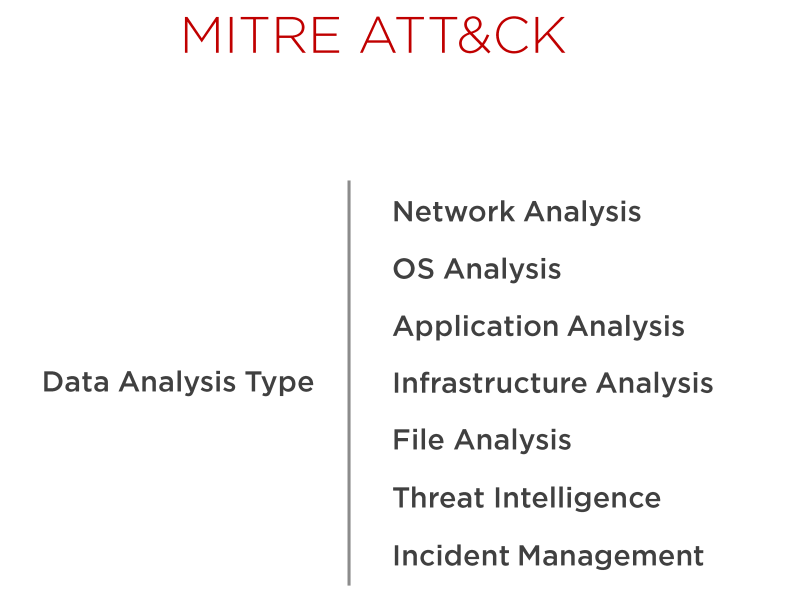
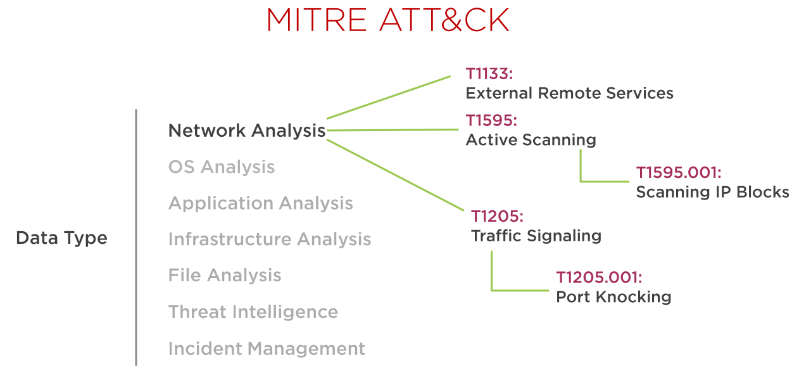

## MITRE ATT&CK
¿Has escuchado de MITRE ATT&CK? ATT&CK por sus siglas en inglés, significa: "tácticas, técnicas del adversario y conocimiento común". En una fuente de información colaborativa entre los profesionales de seguridad. 

Permite identificar mejor la huella de TTP (técnicas, tácticas y procedimientos) más amplia (y más profunda) que un adversario dado deja atrás en el curso de una campaña de penetración. Es una fuente a tener en cuenta para entender cómo operan los atacantes. 

Los defensores utilizan este framework y las herramientas asociadas en función de la fuente de datos que posean. Muchas de estas herramientas pueden tener capacidades que se superpongan pero representan la mejor opción para formar un conjunto amplio que nos permita defendernos de forma efectiva.

Dependiendo del tipo de dato que tengamos, las herramientas se categorizan de forma diferente:



Si por ejemplo tuviéramos una fuente de datos relacionados con la red, podríamos mapear estos datos con MITRE ATT&CK:



Y así sucesivamente.

## Glosario de terminos

### Arkime

!!! quote "Cita de [Arkime](https://arkime.com/)"
    Augment your current security infrastructure to store and index network traffic in standard PCAP format.
    Arkime is not meant to replace Intrusion Detection Systems (IDS) but instead provides more visibility. 

### Command and control (C2)

!!! quote "Cita de [Tarlogic](https://www.tarlogic.com/es/glosario-ciberseguridad/c2-command-and-control/)"
    La mayoría de las amenazas necesitan conectarse a un entorno fuera de la organización, donde poder comunicarse con los operadores de estas amenazas (Threat Actors) para recibir instrucciones, exfiltrar información, etc. Estas comunicaciones de manera general no son contra los entornos finales de estos actores, sino que son hacia servidores que controlan, centralizan la información y realizan las acciones necesarias. Estos servidores se conocen como servidores Command and Control, C&C o C2.

### IOC

!!! quote "Cita de [attacksimulator](https://attacksimulator.es/blog/8-tipos-de-indicadores-de-compromiso-ioc-y-como-reconocerlos/)"
    Los indicadores de compromiso o IoCs son pistas y pruebas de una brecha de datos, que generalmente se ven durante un ataque de ciberseguridad. Estos indicadores pueden revelar que se ha producido un ataque, qué herramientas se han utilizado para el mismo y quién está detrás. Suelen ser recolectados a través del software, incluyendo los sistemas antivirus y antimalware. Para entenderlo mejor, intenta pensar que los indicadores de compromiso son como las migas de pan que deja un atacante tras un ciberataque.

### Emotet

!!! quote "Cita de [malwarebytes](https://es.malwarebytes.com/emotet/)"
    El troyano bancario Emotet fue identificado por primera vez por investigadores de seguridad en 2014. Emotet fue diseñado originalmente como un malware bancario que intentaba colarse en su ordenador y robar información confidencial y privada. En versiones posteriores del software se añadieron los servicios de envío de spam y malware, incluidos otros troyanos bancarios.

### Lokibot

!!! quote "Cita de [WeLiveSecurity](https://www.welivesecurity.com/la-es/2021/09/30/lokibot-principales-caracteristicas-malware-roba-credenciales/)"
    Lokibot, también conocido como Loki PWS o Loki-bot, es un malware perteneciente a la familia de troyanos que está activo desde 2015 y es utilizado desde entonces en campañas a nivel global. Fue diseñado con el objetivo de robar credenciales de navegadores, clientes FTP/ SSH, sistemas de mensajería, y hasta incluso de billeteras de criptomonedas.

### Spear phising

!!! quote "Cita de [Kasperksy](https://latam.kaspersky.com/resource-center/definitions/spear-phishing)"
    El spear phishing es una estafa de correo electrónico o comunicaciones dirigida a personas, organizaciones o empresas específicas. Aunque su objetivo a menudo es robar datos para fines maliciosos, los cibercriminales también pueden tratar de instalar malware en la computadora de la víctima.

## Práctica de Arkime

+ Analizando tráfico spear phising (Dridex) `fichero: 01-04.spearphising-dridex.pcap`
    + Filtramos conexiones por el puerto 80 porque tenemos sospechas de un tráfico malicioso.
    + Filtramos el dominio (URI), que no incluyan los de microsoft update, y luego todos los dominios con el asterisco:

    `port.dst == 80 && http.uri != www.download.windowsupdate.com/*`

    + El número de bytes de una petición también da pistas, ¿qué tipo de archivo es?
    + Entramos en el detalle, ¿a qué host apunta? ¿hay algo extraño en ese detalle?
    + Buscamos en virustotal a ver que nos aparece.

+ Identificando tráfico C2C (Emotet) `fichero: 02.c2-emotet.pcap`
    + Ordenamos por tamaño y comprobamos uno muy grande. ¿Qué destino tiene?
    + ¿Qué aparece en el detalle que ya hemos visto?
    + Queremos ver el tráfico post infección, filtramos entre el inicio de este paquete y 5 minutos más. En la tercera sesión vemos el *request* de nuestro troyano. Vemos dos sesiones subsiguientes y ese es **el tráfico postinfección** ¿Qué destino tienen estas dos sesiones?
    + Una vez infectado un nuevo sistema, utiliza un nuevo set de IPs, no el dominio comprometido y se dedica a recopilar información. Nuestro siguiente paso es investigar qué ha comunicado el troyano desde nuestra vícitma, a estos nodos del Command and control. Si expandimos la segunda o tercera sesión, podremos ver la petición HTTP completa. Vemos que en términos de cabeceras HTTP parece bastante más legítima que el anterior caso, ya que contiene un número normal de ellas, tal y como esperaríamos ver desde una sesión de un navegador normal. Incluso tenemos cabeceras clave como el `Referrer` y esto es importante porque en caso de no estar, hay algunos IDS que generarían una alerta. Seguimos bajando y llegamos al **cuerpo** de la petición:
	    + Hay un número pequeño de datos simplemente mirando el tamaño
	    + Cada carácter representa un byte por lo que hay pocos bytes
	    + Poca información enviándose al panel C2
	    + No podemos interpretar estos bytes porque están cifrados. Porqué:
		    + Emotet usa cifrado para proteger estos datos
		    + Aunque no se esté usando TLS, se establece una comunicación segura para cifrar los datos que envía
        + Como conclusión sabemos que, pese a la infección, se está enviando relativamente poca información de la víctima al C2

+ Identificando tráfico C2C (Lokibot) `fichero: 03.c2-lokibot.pcap`
    + Para este PCAP vamos a utilizar `SPI View`.
    + Por razones de rendimiento, no se cargan todos los datos cuando vamos a esta página. Un ejemplo de este comportamiento es el DNS
	    + Indica que tiene 10 entradas pero no se cargan todas
	    + Si hacemos click en el botón *Cargar todo*, entonces podremos ver toda la información.
        + De todas maneras, para este caso nos centraremos en el user-agent de HTTP. En ocasiones, el `user-agent` puede ser una pieza de información muy significativa que podemos usar para pivotar entre indicios y explorar que está ocurriendo en nuestra red. Este es un ejemplo de **Lokibot** y este malware, históricamente, ha usado un nombre de `user-agent` muy distintivo. ¿Cual es el user agent de Lokibot?
        + Pivotamos sobre ese User Agent. Una de las primeras cosas que pasan con una infección de Lokibot es que se produce un contacto con su panel de control. ¿Cuál es la URL del panel de control en este caso?
        + Si expandimos el primer *check-in* con el panel podemos ver que parece que se ha enviado nuestro nombre de usuario, así como nuestro nombre de PC. ¿Dónde aparece?
        + Si nos fijamos, parece una infraestructura sofisticada porque el panel parece ser que se ha configurado para que devuelva un código HTTP legítimo `404 not found`. Incluso incluye en el body de la respuesta un `File not found`. Esto está hecho expresamente para despistar al analista de seguridad, haciéndole pensar que a pesar de que se ha producio una infección en el entorno, no se ha podido contactar con éxito con el panel de control. Si aún así no estamos seguros de esto, podríamos continuar analizando los `check-ins` adicionales que tenemos.
        + Si miramos el siguiente, vemos que se ha enviado mucha más información al panel. ¿Podemos saber que ha pasado? 
        + En ocasiones los investigadores de seguridad publican información sobre como descifrar el tráfico cifrado del command&control para ciertas familias de malware.
            + Este sería siempre el siguiente paso a realizar, mirar si hay publicaciones hechas al respecto, o scripts o cualquier material que nos ayude a identificar el tráfico.
            + No obstante, esto no siempre es posible así que sólo nos queda crear una hipótesis que parte de los resultados de nuestro análisis.

+ Identificación de malware usando comunicaciones seguras con TLS y utilización de hashes JA3 para detectar nodos del command&control. `fichero: 01-04.spearphising-dridex.pcap`
    + Es importante entender cómo observar y analizar tráfico cifrado. Debido al cifrado, mucha información que nos gustaría observar no puede ser visualizada. Esto, sin embargo, no quiere decir que como defensores no tengamos opciones y en eso se centra este ejercicio. Volvemos al primer PCAP de la clase pero en lugar de centrarnos en el payload que *suelta* el ejecutable, nos centraremos en el tráfico post infección, particularmente en el TLS. 
        + Empezamos en la pestaña Conexiones que todavía no habíamos usado.
            + En esta pestaña se muestrar gráficos de comunicaciones entre nodos.
            + Aquí vemos que hay un nodo predominante y que es el que más conexiones produce. ¿Cual es la IP del host?
        + Ahora filtraremos por protocolo HTTP y por sesiones con muchos bytes:
            ```
            protocols == http && bytes > 500000
            ```
        + ¿Cómo esta enmascarado el troyano? 
        + Quitamos el filtro de los bytes y seleccionamos el tiempo desde esta sesión y media hora más. Vemos tráfico legítimo como windows update u otros.
        + Cambiamos el filtro y quitamos el número de bytes y ponemos para ver si el malware usa cifrado, manteniendo la IP de nuestro host investigado
	        ```
	        protocols == tls && ip.src == 192.168.56.103
	        ```
    + Parece que hay sesiones legítimas pero también hay un tráfico TLS por el puerto no estándar. ¿Qué puertos son?
    +  Miramos la información del certificado de estas sesiones y parece autofirmado y "raro". También tenemos valores de hashes JA3 y JA3s
	    + Son hashes que se calculan basados en la información proporcionada por el handshake inicial de TLS (tecnología opensource de Salesforce)


## Referencias

[La matriz de MITRE: tácticas y técnicas en entornos industriales](https://www.incibe-cert.es/blog/matriz-mitre-tacticas-y-tecnicas-entornos-industriales)

[How to Use MITRE ATT&CK to Map and Track Adversary TTPs](https://www.eclecticiq.com/take-action-with-cti/how-to-use-mitre-attck-to-map-and-track-adversary-ttps)
